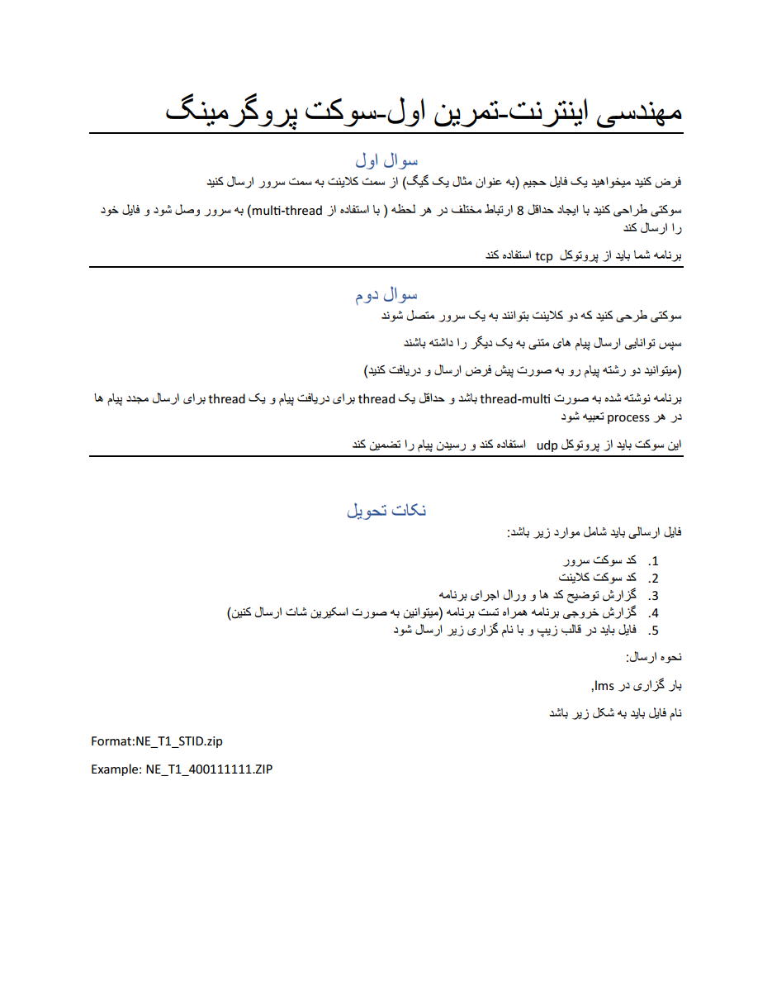

# **✉️ Socket Programming Internet Engineering Project | پروژه مهندسی اینترنت برنامه‌نویسی سوکت**

**A two-question university project in which socket programming is designed in Python language.**

**یک پروژه دانشگاهی دو سواله که در آن برنامه‌نویسی سوکت در زبان پایتون طراحی میشود.**

# 💬 **نکات پروژه**

* گزارش و عکس‌های برنامه در دایرکتوری Report قرار دارند.
* برای اجرا برنامه، به پایتون بالاتر از نسخه 3.6 نیاز دارید.
* کتابخانه‌های مورد نیاز در فایل requirements.txt قرار دارند.
* برای دسترسی به همه‌ی پروژه‌های دانشگاهی من، به این لینک مراجعه کنید:

👈🏻 **[پروژه‌های دانشگاهی من](https://github.com/bestmahdi2/Uni__Bachelors_SKU_Path)**

# 📝 **توضیحات پروژه**

